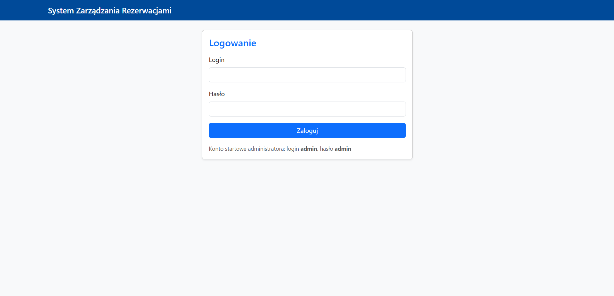
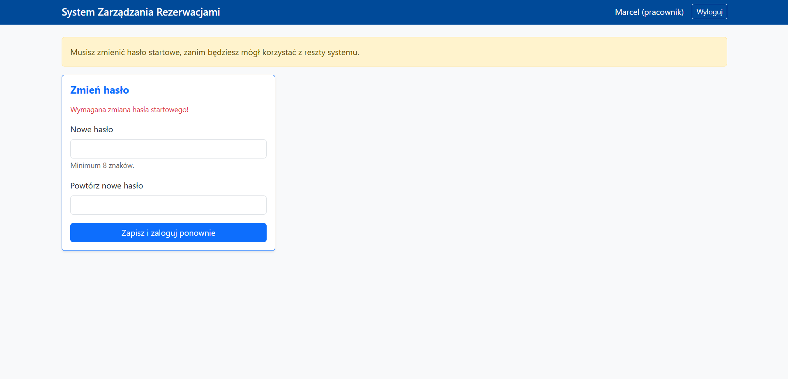
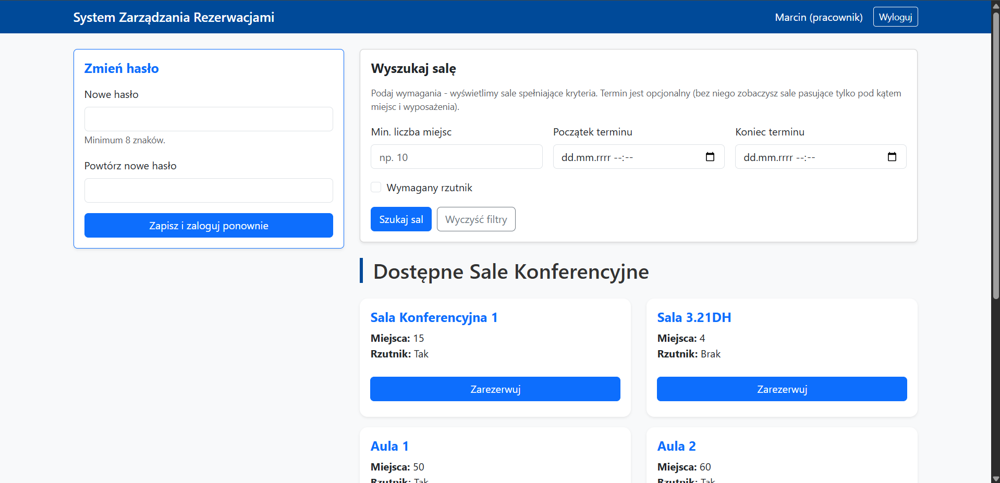
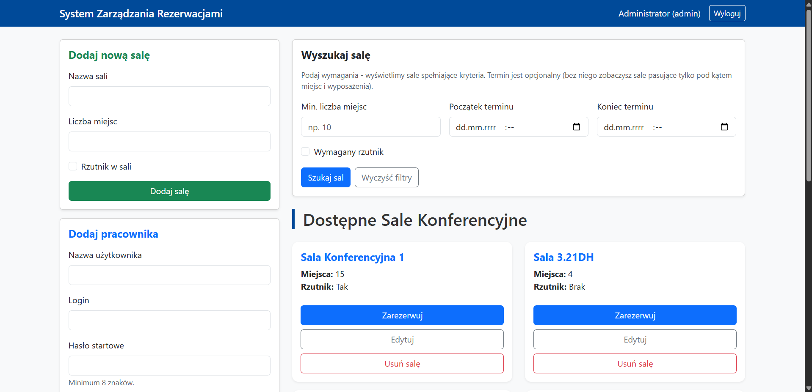
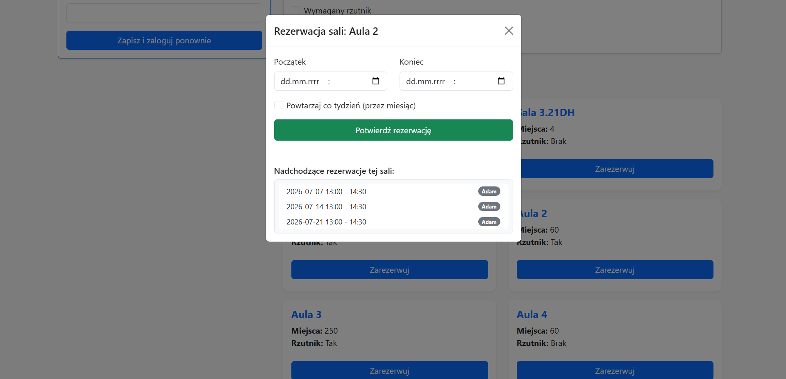
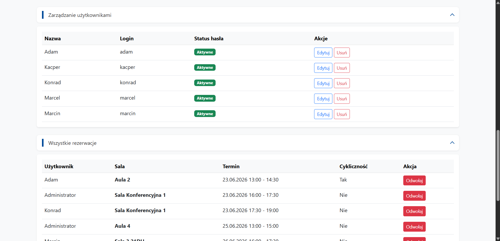

# 🏢 System Zarządzania Rezerwacjami Sal

## O projekcie (About the Project)

Wewnętrzna aplikacja webowa do rezerwacji sal konferencyjnych w firmie. Projekt z przedmiotu **Projekt Zespołowy**, robiony etapami na zajęciach.

System pozwala pracownikom przeglądać sale, filtrować je według wymagań i rezerwować terminy. Administrator zarządza salami, użytkownikami i ma podgląd wszystkich rezerwacji w systemie.

### 👥 Role użytkowników

* **Administrator:** dodaje i edytuje sale, zakłada konta pracowników, widzi wszystkie rezerwacje, może je odwoływać.
* **Pracownik:** wyszukuje sale, składa rezerwacje, zarządza własnymi rezerwacjami, zmienia hasło.

### 🛠️ Technologie i architektura

* **Backend:** Python, Flask, SQLAlchemy (ORM)
* **Baza danych:** SQLite (`database.db` tworzona automatycznie przy pierwszym uruchomieniu)
* **Frontend:** HTML, Bootstrap 5, JavaScript (fetch API)
* **Bezpieczeństwo:** hashowanie haseł (`werkzeug.security`), tokeny CSRF (`Flask-WTF`), sesje z podziałem ról

### ⚙️ Najważniejsze funkcje

* Logowanie z podziałem na role (`admin` / `pracownik`)
* Wymuszenie zmiany hasła startowego u nowego pracownika
* Wyszukiwanie sal po liczbie miejsc, rzutniku i opcjonalnym terminie (sprawdzanie dostępności)
* Rezerwacja pojedyncza lub cykliczna (co tydzień przez miesiąc)
* Walidacja konfliktów terminów, system nie pozwala na nakładające się rezerwacje
* Panel administratora ze zwijanymi sekcjami (użytkownicy, wszystkie rezerwacje, moje rezerwacje)
* REST API pod ścieżkami `/api/...` obsługiwane z poziomu panelu

### 📌 Stan projektu

To nadal **prototyp** studencki. Do zrobienia m.in. podział kodu na osobne moduły i migracje bazy (np. Flask-Migrate).

## English Summary

An internal web application for booking conference rooms in a company setting. Built as a **team university project**, developed iteratively during classes.

Employees can browse and filter rooms, check availability, and make reservations. Administrators manage rooms and user accounts and can view or cancel any booking.

### Key features

* Role-based access (`admin` / employee)
* Forced password change on first login for new employees
* Room search by capacity, projector, and optional time slot
* Single or recurring weekly reservations (every week for a month)
* Conflict detection for overlapping bookings
* Collapsible admin sections for users and reservations
* Password hashing, CSRF protection, session-based auth

**Tech stack:** Python, Flask, SQLAlchemy, SQLite, Bootstrap 5, JavaScript.

## 📸 Zrzuty ekranu / Screenshots


*Ekran logowania / Login page*



*Pierwsze logowanie pracownika, wymuszona zmiana hasła / First login, password change required*



*Panel główny pracownika / Employee main panel*



*Panel główny administratora / Admin main panel*



*Rezerwacja sali / Room reservation*



*Panel administratora, rozwinięte sekcje na dole (użytkownicy, rezerwacje) / Admin panel, expanded bottom sections*




## 🚀 Uruchomienie lokalne / Local setup

```bash
git clone https://github.com/Marcin10H/Projekt-Zespo-owy---Hajduk-Go-ucki-Gaw-da.git
cd Projekt-Zespo-owy---Hajduk-Go-ucki-Gaw-da

python -m venv venv
.\venv\Scripts\activate        # Windows
# source venv/bin/activate     # Linux / macOS

python -m pip install -r requirements.txt
python app.py
```

Aplikacja działa pod adresem: **http://127.0.0.1:5000**

**Konto startowe administratora:** login `admin`, hasło `admin`
